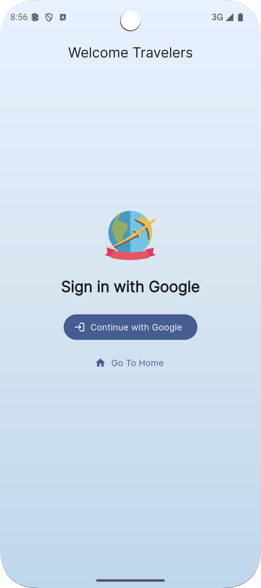
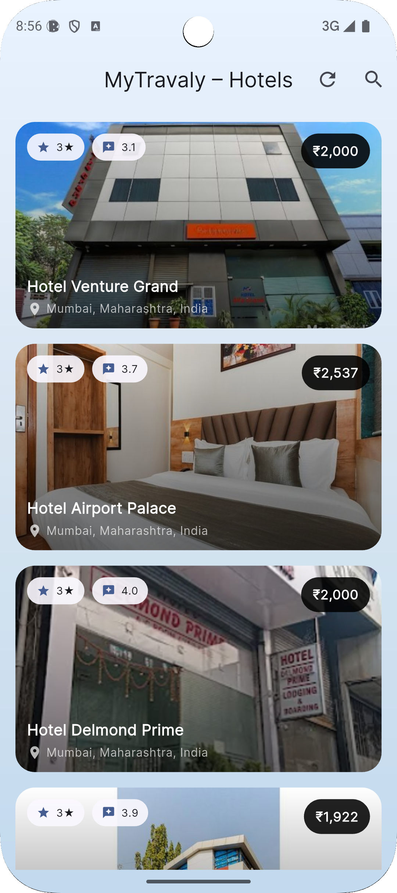
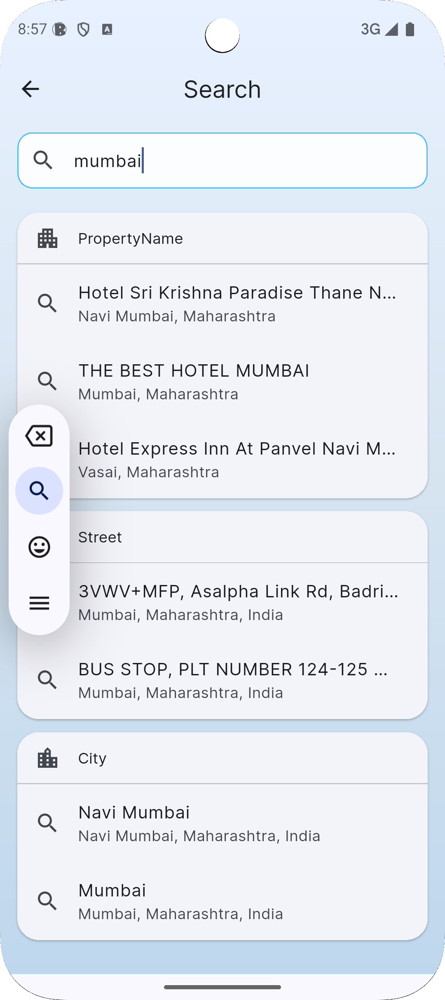
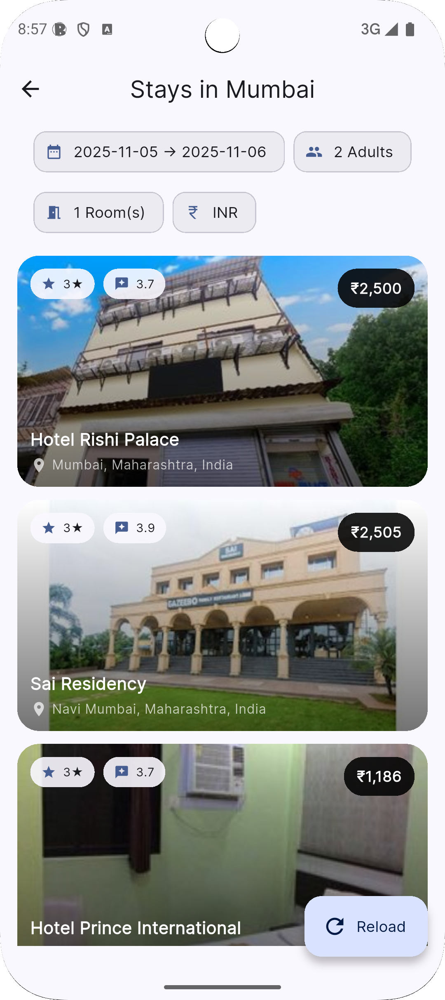

# 🏨 MyTravaly – Hotel Booking App

A modern Flutter application that lets users search, explore, and view hotels with real-time data integration via MyTravaly APIs.  
Built using **Flutter + Riverpod + GoRouter + CachedNetworkImage**, with a clean UI and seamless navigation.

---

## ✨ Features

- 🔍 **Smart Search**
    - Auto-complete suggestions (hotel, city, country)
    - Search results fetched dynamically from MyTravaly API
- 🏠 **Home Page**
    - Fetches and displays property listings with refresh control
    - Pull-to-refresh with smooth shimmer/loading states
- 🏨 **Hotel Details**
    - Opens hotel details in an embedded WebView
    - Supports HTTPS redirection and smooth navigation
- 💬 **User-friendly Interface**
    - Gradient backgrounds with a light blue theme
    - Interactive property cards with rating, price, and address
- 📱 **Cross-Platform Support**
    - Android and iOS compatible
    - Optimized layouts for multiple screen sizes

---

## 🧠 Tech Stack

| Area | Package / Tool |
|------|----------------|
| State Management | [Riverpod](https://riverpod.dev) |
| Navigation | [GoRouter](https://pub.dev/packages/go_router) |
| Networking | [Dio](https://pub.dev/packages/dio) |
| Image Caching | [CachedNetworkImage](https://pub.dev/packages/cached_network_image) |
| WebView | [webview_flutter](https://pub.dev/packages/webview_flutter) |
| App Icons | [flutter_launcher_icons](https://pub.dev/packages/flutter_launcher_icons) |

---

## 🧭 Folder Structure
lib/
├── core/
├── common/
├── features/
│ ├── auth/
│ ├── home/
│ ├── property/
│ └── search/
├── models/
└── main.dart


---

## 🚀 Getting Started

### 1️⃣ Prerequisites
Make sure you have:
- Flutter SDK ≥ 3.0
- Android Studio / VS Code with Flutter plugin

### 2️⃣ Install Dependencies
```bash
flutter pub get

📦 Build App Icons

To set the custom launcher icon:

flutter pub run flutter_launcher_icons


🖼️ App Screenshots

Below are the screenshots showing different parts of the app 👇

<div align="center">
 🌐 Login Screen

 🏠 Search Page

 🔍Search Page

 📋 Search Results
 </div>

🗂️ All screenshots are stored in the /screenshots/ folder in your project root.